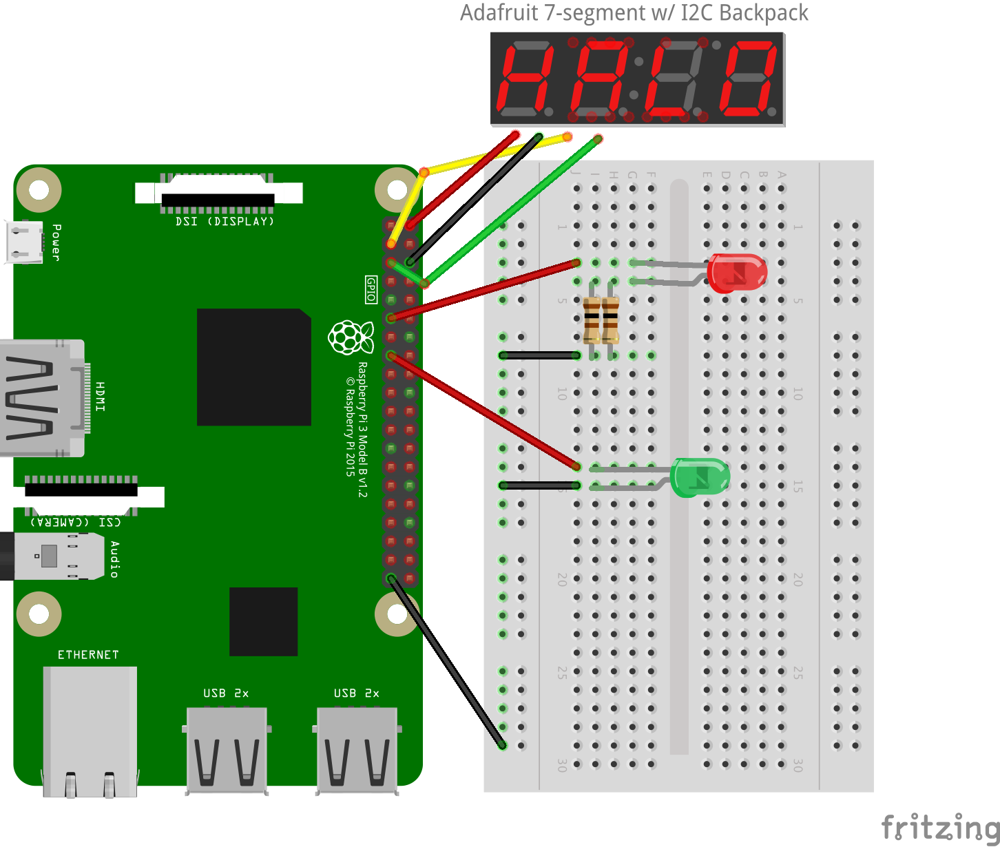

# pi-clock

A Raspberry Pi-powered light-based alarm clock for toddlers



#### <span style="color:red">Red</span> means stay asleep!

#### <span style="color:green">Green</span> means it's time to wake up!

## Installation

```sh
$ git clone https://www.github.com/avonmoll/pi-clock/
$ cd pi-clock
$ npm install
```

(`sudo` may be necessary if installing directly on RPi)

## Usage

Choose one:

### [pm2](pm2.keymetrics.io) (Recommended)

Install pm2: 

```sh
$ npm install -g pm2
```

Configure startup by running the following and then executing the last line of the output: 

```sh
$ pm2 startup
```

Start app and save so pm2 will start the app on reboot: 

```sh
$ sudo pm2 start server.js -o log --name pi-clock
$ pm2 save
```

### cron

The following command adds an entry to the root crontab to run the app on reboot.

```sh
$ sudo echo "@reboot root cd /home/<path-to>/pi-clock && sudo node server.js >> log 2>&1 &" >> /etc/crontab
$ sudo reboot
```

## Materials

-   [Adafruit 7-segment 4-digit LED display with I2C backpack](https://www.adafruit.com/products/1002)
    -   Recommend the white display to avoid clashing with indicator LEDs
-   [10mm red LED](https://www.taydaelectronics.com/led-10mm-red-water-clear-ultra-bright.html) (note: an additional 100 ohm resistor may be needed in series with one of the existing resistors since I used an LED rated for higher voltage)
-   [10mm green LED](https://www.taydaelectronics.com/led-10mm-green-water-clear-ultra-bright.html)
-   resistors to protect LEDs
-   male-female jumper wires
-   male-male jumper wires
-   breadboard or other perfboard

## Tools

-   Soldering iron (for the I2C backpack)

## Build & development

Run `grunt` for building and `grunt serve` for preview.

## Testing

Running `grunt test` will run the unit tests with karma.

* * *

The web server was scaffolded with [yo angular generator](https://github.com/yeoman/generator-angular)
version 0.15.1.
